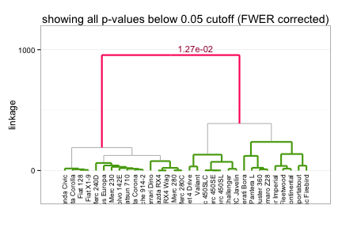
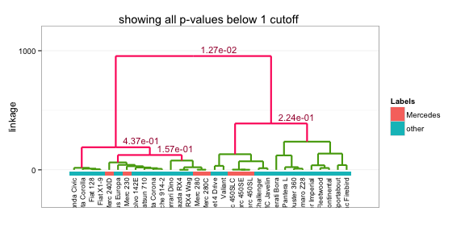

SigClust2 
=======================

### Contents
1. [Status](#status)
3. [Introduction](#intro)
4. [Example](#example)
5. [References](#refs)


### <a name="status"></a> Status
`R` implementation of various extensions to the CRAN `sigclust` package.
Currently, the package only includes a simple hierarchical extension,
HSigClust (`HSCtest()`), with the intention of expanding the package to also 
include a multi-cluster extension, KSigClust (`KSCtest()`).

A short to-do list for the near future:
* clean up `hsigclust-class` methods:
  * `diagnostics`: make work
  * `validity`: remove, not allowing setting 
  * `FWERcutoffs`: improve using structure of tree
* allow for more flexibility in `plot` of `hsigclust-class`
  * print p-value cutoffs
  * decouple p-value printing and branch highlighting
  * add text flexibility to title of plot
* complete vignette, replace .Rnw w/ .pdf (also switch to `knitr`?)
* translate `KSCtest()` from Matlab to `R`
* update README along the way


### <a name="intro"></a> Introduction
This package may be used to assess the statistical significance in
hierarchical clustering. Given the results of hierarchical clustering,
the approach sequentially tests starting from the root node whether each 
split/join corresponds to "true" clustering. The hypothesis test performed at 
each node is based on the approach described in Liu et al. (2008) with 
appropriate modifications for hierarchical clustering. The work is ongoing, and 
may involve changes to the current approach (and code).


### <a name="example"></a> Example
Consider the `mtcars` dataset. The HSigClust testing procedure may be 
implemented for a specific clustering procedure, e.g. euclidean dissimilarity 
and average linkage, using the call:


```r
library(SigClust2)
# run HSigClust on toy dataset using Ward linkage
our_hsc <- HSCtest(mtcars, metric = "euclidean", linkage = "ward", alphaStop = 1)
```


In the above call to `HSCtest()` we specify `alphaStop=1` (the default value)
which results in the procedure testing at all branches along the dendrogram.
Alternatively, we may have specified `alphaStop=0.05` for the testing procedure
to iteratively test from the top using a FWER control stopping procedure 
originally described in Meinshausen et al. 2010. 


```r
# run HSigClust on toy dataset with FWER control at 0.05 algorithm will skip
# all tests ignored by sequential FWER procedure.
short_hsc <- HSCtest(mtcars, metric = "euclidean", linkage = "ward", alphaStop = 0.05)
```


We can access the p-values at each node by calling the getter function, 
`mpvalnorm`:


```r
# only print p-values for the last 5 merges
mpvalnorm(short_hsc)[27:31, ]
```

```
## [1] 47.00000  0.56312 47.00000  0.21264  0.01027
```


The order of the p-values is according to the height of each branch, i.e. 
`mpvalnorm(our_hsc[31, ])` corresponds to the highest, (n-1)st branch, at the 
top of the dendrogram. p-values of `2` correspond to branches not having enough
samples to test according to the `minObs` parameter. p-values of `47`
correspond to branches skipped according to the FWER control procedure (these 
will supercede `2` values).  

A quick way to check the results is to simply `plot()` the output. The 
corresponding dendrogram is returned with significant splits appropriately 
labeled:


```r
plot(our_hsc)
```

 


Other plotting options are possible. Suppose we are interested in looking at 
how Mercedes cars might be distributed along the dendrogram.


```r
# extract car maker names
makers <- sapply(strsplit(rownames(mtcars), " "), "[[", 1)
mylabs <- ifelse(makers == "Merc", "Mercedes", "other")

# plot dendrogram showing all p-values and include 'mercedes' label
plot(our_hsc, colGroups = mylabs, textLabs = TRUE, FWER = FALSE, alpha = 1)
```

 


Note that the call to `plot()` returns a `ggplot` object. Therefore, we can 
easily adjust the plot using any function from the `ggplot2` package. 


### <a name="refs"></a> References

* Liu Y, Hayes DN, Nobel A, and Marron JS. (2008). "Statistical significance of 
clustering for high-dimension, low–sample size data." 
_Journal of the American Statistical Association_, 103(483).
* Huang H, Liu Y, Yuan M, and Marron JS. (2013). "Statistical significance of 
clustering using soft thresholding." _arXiv preprint [arXiv:1305.5879]_.
* Kimes P, Hayes DN, Liu Y, and Marron JS. "HSigClust: Statistical significance 
of hierarchical clustering." _In preparation_.

[arXiv:1305.5879]: http://arxiv.org/abs/1305.5879
