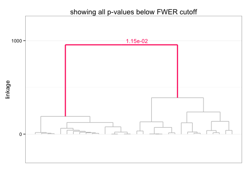

SigClust2 
=======================

### Contents
1. [Issues](#issues)
2. [Status](#status)
3. [Introduction](#intro)
4. [Example](#example)
5. [References](#refs)


### <a name="issues"></a> Issues
The current implementation takes a few mintues to complete for
datasets with moderately 'large' data (e.g. ~5min for n>400, d>2000) 
due to the computational time needed to perform hierarchical clustering 
on each Monte Carlo simulated dataset. Some increase in speed is possible 
using `gputools::gpuDistClust`, but this requires access to a GPU processor. 
Implementation of a 'short stopping' rule when all current branches return 
non-significant results should also .


### <a name="status"></a> Status
`R` implementation of various extensions to the CRAN `sigclust` package.
Currently, the package only includes a simple hierarchical extension,
HSigClust (`HSCtest()`), with the intention of expanding the package to also 
include a multi-cluster extension, KSigClust (`KSCtest()`).

A short to-do list for the near future:
* clean up `hsigclust-class` methods:
  * `show`: produce more useful output
  * `diagnostics`: make work
  * `summary`: produce more useful output
* revise `hsigclust` class to be "lighter"
* incorporate short stopping option
* translate `KSCtest()` from Matlab to `R`
* complete vignette, replace .Rnw w/ .pdf (also switch to `knitr`?)
* update README along the way


### <a name="intro"></a> Introduction
This package may be used to assess the statistical significance of clustering in
hieararchical clustering. Given the results of hierarchical clustering,
the approach sequentially tests starting from the root node whether each 
split/join corresponds to "true" clustering. The hypothesis test performed at 
each node is based on the approach described in Liu et al. (2008) with 
appropriate modifications for hierarchical clustering. The work is ongoing, and 
may involve substantial changes to the current approach (and code).


### <a name="example"></a> Example
Consider the `mtcars` dataset. The HSigClust testing procedure may be 
implemented for a specific clustering procedure, e.g. euclidean dissimilarity 
and average linkage, using the call:


```r
library(SigClust2)
our_hsc <- HSCtest(mtcars, metric = "euclidean", linkage = "ward")
```


We can access the p-values at each node by calling the getter function, 
`mpvalnorm`:


```r
mpvalnorm(our_hsc)[25:31]
```

```
## [1] 0.12395 2.00000 2.00000 0.52062 2.00000 0.25445 0.01145
```


A quick way to check the results is to simply `plot()` the output. The 
corresponding dendrogram is returned with significant splits appropriately 
labeled:


```r
plot(our_hsc)
```

 


### <a name="refs"></a> References

* Liu Y, Hayes DN, Nobel A, and Marron JS. (2008). "Statistical significance of 
clustering for high-dimension, low–sample size data." 
_Journal of the American Statistical Association_, 103(483).
* Huang H, Liu Y, Yuan M, and Marron JS. (2013). "Statistical significance of 
clustering using soft thresholding." _arXiv preprint [arXiv:1305.5879]_.
* Kimes P, Hayes DN, Liu Y, and Marron JS. "HSigClust: Statistical significance 
of hierarchical clustering." _In preparation_.

[arXiv:1305.5879]: http://arxiv.org/abs/1305.5879
