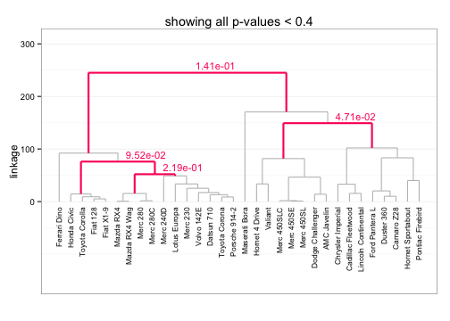

SigClust2 
=======================
_______________________

### Contents
1. [Status](#status)
2. [Introduction](#intro)
3. [Example use](#use)
4. [References](#refs)


### <a name="status"></a> Status
`R` implementation of various extensions to the CRAN `sigclust` package.
Currently, the package only includes a barely-working form of a hierarchical 
extension, HSigClust, with the intention of expanding the package to also 
include a multi-cluster extension, KSigClust.

A short to-do list for th near future:
 * clean up hsigclust methods:
  * `diagnostics`
  * `summary`
  * `FWERcontrol`
  * `plot`
  * `print`
 * translate KSCtest from Matlab to `R`
 * complete vignette - switch to `knitr`?
 * update README along the way (this!)


### <a name="intro"></a> Introduction
This package may be used to assess the statistical significance of clustering in
hieararchical clustering. Given the results of hierarchical clustering,
the approach sequentially tests starting from the root node whether each 
split/join corresponds to "true" clustering. The hypothesis test performed at each
node is based on the approach described in Liu et al. (2008) with appropriate
modifications for hierarchical clustering. The work is ongoing, and may involve
substantial changes to the current approach (and code).


### <a name="use"></a> Example use
Using the `mtcars` dataset, the HSigClust testing procedure may be applied with 
the call:


```r
library(SigClust2)
our_hsc <- HSCtest(mtcars, metric = "euclidean", linkage = "average")
```


For easy interpretation of the results, simply plot the output as a dendrogram:


```r
plot(our_hsc)
```

 


### <a name="refs"></a> References

* Liu Y, Hayes DN, Nobel A, and Marron JS. (2008). "Statistical significance of clustering for high-dimension, low–sample size data." _Journal of the American Statistical Association_, 103(483).
* Huang H, Liu Y, Yuan M, and Marron JS. (2013). "Statistical significance of clustering using soft thresholding." _arXiv preprint [arXiv:1305.5879]_.
* Kimes P, Hayes DN, Liu Y, Marron JS. "HSigClust: Statistical significance of hierarchical clustering." _In preparation_.

[arXiv:1305.5879]: http://arxiv.org/abs/1305.5879
