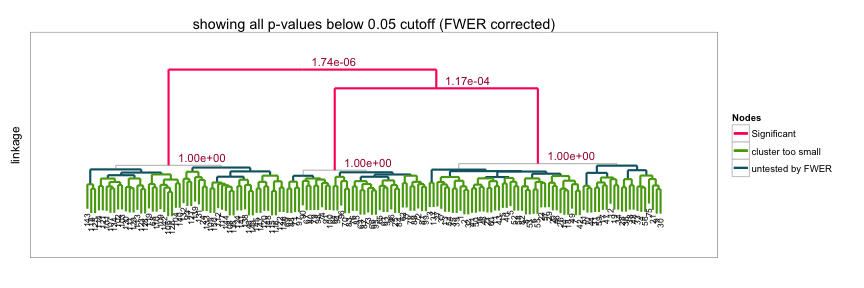

sigclust2 [](https://travis-ci.org/pkimes/sigclust2)
=======================

## Contents
1. [Introduction](#intro)
2. [Testing](#test)
3. [Plotting](#plot)
4. [Miscellanea](#misc)
5. [References](#refs)


## <a name="intro"></a> Introduction
___Note that this document is still under construction.___  

This package may be used to assess statistical significance in 
hierarchical clustering. To assess significance in high-dimensional data,
the approach assumes that a cluster may be well approximated by a single
Gaussian (normal) distribution. Given the results of hierarchical clustering,
the approach sequentially tests from the root node whether the data at each split/join
correspond to one or more Gaussian distributions. The hypothesis test performed at 
each node is based on a Monte Carlo simulation procedure, and the family-wise error
rate (FWER) is controlled across the dendrogram using a sequential testing procedure.  

An illustration of the basic usage of the package is provided in the [Tutorial](#tutorial).
Variations on the basic testing procedure are available in the [More Examples](#examples) section.  

<!--You can also interactively "test-drive" the approach with toy datasets using the `shiny`
application available through [shinyapps.io][shinyshc].-->


To install the package, simply obtain the `devtools` package from CRAN and type the following
in the `R` console:  
```{Rconsole}  
R> devtools::install_github("pkimes/sigclust2")
```

The package can then be loaded using the standard call to `library`.  


```r
suppressPackageStartupMessages(library("sigclust2"))
```

For the following examples, we will use a simple toy example with 150 samples (_n_) with
1000 measurements (_p_). The data are simulated from three Gaussian (normal) distributions. 


```r
n1 <- 60; n2 <- 40; n3 <- 50; n <- n1 + n2 + n3
p <- 1000
data <- matrix(rnorm(n*p), nrow=n, ncol=p)
data[, 1] <- data[, 1] + c(rep(5, n1), rep(-5, n2), rep(0, n3))
data[, 2] <- data[, 2] + c(rep(0, n1+n2), rep(sqrt(3)*5, n3))
```
The separation of the three underlying distributions can be observed from a PCA (principal components
analysis) scatterplot. While the separation is clear in the first 2 PCs, recall that the data
actually exists in 1000 dimensions.


```r
data_pc <- prcomp(data)
par(mfrow=c(1, 2))
plot(data_pc$x[, 2], data_pc$x[, 1], xlab="PC2", ylab="PC1")
plot(data_pc$x[, 3], data_pc$x[, 1], xlab="PC3", ylab="PC1")
```

 


## <a name="test"></a> Testing

We can now perform the SHC testing procedure using the `shc` funciton. For the function to work,
three arguments must be specified:  

* `x`: the data as a `matrix` with samples in rows,  
* `metric`: the dissimilarity metric, and  
* `linkage`: the linkage function to be used for hierarchical clustering.  

While several combinations are possible, for reasons outlined in the corresponding
paper [(Kimes et al. 2014)](#refs) relating to how the method handles testing when n << p,
we recommmend using `"euclidean"` as the metric, and any of `"ward.D2"`, `"single"`, `"average"`,
`"complete"` as the linkage.  

__Note:__ if other metric functions which do not statisfy rotation invariance are desired,
e.g. one minus absolute Pearson correlation (`"cor"`) or L1 (`"manhattan"`),
`null_alg = "2means"` and `ci = "2CI"` should be specified. The `null_alg` and `ci` parameters
specify the algorithm for clustering and measure of "cluster strength" used to generate the null
distribution for assessing significance. Since the K-means algorithm (`2means`) optimizes
the 2-means CI (`2CI`), the resulting p-value will be conservative. However, since the hierarchical
algorithm is not rotation invariant, using `null_alg = "hclust"` or `ci = "linkage"` produces
unreliable results. An example for testing using Pearson correlation is given in the
[More Examples](#examples) section.  

For now, we just use the recommended and default parameters.


```r
shc_result <- shc(data, metric="euclidean", linkage="ward.D2")
```

The output is a S3 object of class `shc`, and a brief description of the analysis results can be
obtained by the `summary` function.


```r
summary(shc_result)
```

```
## shc object created using shc(..)
## 
## clustered using:
##     linkage = ward.D2
##     dissimilarity = euclidean
## SHC applied with:
##     n_sim = 100
##     icovest = 1
##     ci = 2CI
##     ci_null = 
## FWER control:
##     FALSE
##     min obs for testing = 10
## number of p-values < 0.05: 2.
```

The analysis output can be accessed using the `$` accessor. More details on the different entries
can be found in the documentation for the `shc` function. 


```r
names(shc_result)
```

```
##  [1] "in_mat"     "in_args"    "eigval_dat" "eigval_sim" "backvar"   
##  [6] "nd_type"    "ci_dat"     "ci_sim"     "p_emp"      "p_norm"    
## [11] "idx_hc"     "hc_dat"
```

The computed p-values are probably of greatest interest. Two p-values are computed as part of the
SHC testing procedure: (1) an empirical p-value (`p_emp`), and (2) a Gaussian approximate
p-value (`p_norm`). The p-values are computed based on comparing the observed strength of
clustering in the data against the expected strength of clustering under the null hypothesis
that the data from a single cluster. The null distribution is approximated using a
specified number of simulated datasets (`n_sim = 100` default argument). `p_emp` is the empirical
p-value computed from the collection of simulated null datasets. `p_norm` is an approximation to
the empirical p-value which provides more continuous p-values.  

The p-values are reported for each of 149 (`n-1`) nodes along the hierarchical dendrogram.
The very top (root) node of the dendrogram corresponds to the final entry of the `p_emp` and
`p_norm` results. 


```r
cbind(tail(shc_result$p_norm, 5),
      tail(shc_result$p_emp, 5))
```

```
##          hclust_2CI hclust_2CI
## [145,] 9.999990e-01          1
## [146,] 1.000000e+00          1
## [147,] 1.000000e+00          1
## [148,] 1.166296e-04          0
## [149,] 1.737283e-06          0
```

In addition to values between 0 and 1, some p-values are reported as `2`. These values correspond
to nodes which were not tested, either because of the implemented family-wise error rate (FWER)
controlling procedure (`alpha =` argument) or the minimum tree size for testing (`min_n =`
argument).  

Variations on the standard testing procedure are possible by changing the default parameters of
the call to `shc(..)`.  


### <a name="pearson"></a> Pearson Correlations
If testing using `abs(1 - cor(x))` is desired, the following specification should be used.


```r
data_pearson <- shc(data, metric="cor", linkage="average", null_alg="2means")
```

The result will be equivalent to apply the original `sigclust` hypothesis test described
in [Liu et al. 2008](#refs) at each node along the dendrogram.

### <a name="allpvalues"></a> Computing all p-values
If all p-values (or as many as possible) should be calculated, then `alpha = 1` should
be specified.


```r
data_nofwer <- shc(data, metric="euclidean", linkage="ward.D2", alpha=1)
```

### <a name="pearson"></a> Performing tests with multiple indices
The `shc` function allows for testing along the same dendrogram simultaneously using
different measures of strength of clustering.  

For example, it is possible to simultaneously test the above example using both the 2-means
cluster index and the linkage value as the measure of strength of clustering.


```r
data_2tests <- shc(data, metric="euclidean", linkage="ward.D2",
                   ci=c("2CI", "linkage"),
                   null_alg=c("hclust", "hclust"))
tail(data_2tests$p_norm)
```

```
##          hclust_2CI hclust_linkage
## [144,] 9.999981e-01   1.000000e+00
## [145,] 9.999025e-01   1.000000e+00
## [146,] 9.999999e-01   1.000000e+00
## [147,] 1.000000e+00   1.000000e+00
## [148,] 5.364704e-04   5.104256e-03
## [149,] 1.339866e-06   1.464642e-05
```

The results of clustering using `hclust_2CI` and `hclust_linkage` are reported in the columns
of the analysis results. The relative performance of a few of these different combinations are
described in the [corresponding manuscript](#refs) when using Ward's linkage clustering.


## <a name="plot"></a> Plotting

While looking at the p-values is nice, plots are always nicer than numbers. A nice way to
see the results of the SHC procedure is simply to call `plot` on the `shc` class object
created using the `shc(..)` constructor.


```r
plot(shc_result, hang=.1)
```

 

The resulting plot shows significant nodes and splits in red, as well as the corresponding p-values.
Nodes which were not tested, as described earlier, are marked in either green or teal (blue).  

__*Diagnostic plots are currently being implemented and should be available soon.*__


## <a name="misc"></a> Miscellanea

### <a name="rclusterpp"></a> Installing Rclusterpp on OSX

As described in the [`Rclusterpp` wiki][rcpp], to make use of the package's multi-threading
capabilities, a separate compiler (e.g. `gcc-4.9`)  must be installed and used to build the package. 
This essentially amounts to:

1. Download a local `gcc` compiler (e.g. using [`homebrew`][homebrew]).  
2. Modify your `~/.R/Makevars` file to include the following lines:  
    ```{sh}
    CFLAGS += -std=c11
    CXXFLAGS += -std=c++11

    VER=-4.9
    CC=gcc$(VER)
    CXX=g++$(VER)
    SHLIB_CXXLD=g++$(VER)
    ``` 
    where `g++-4.9` is the name of name of the local compiler installed in step 1.  
3. Rebuild `Rclusterpp` and associated dependencies in `R`:  
    ```{Rconsole}
    R> install.packages("Matrix")
    R> install.packages(c("Rcpp", "RcppEigen", "Rclusterpp"), type="source")
    ```  
  
### Planned improvements

* `metric` will be modified to accept functions which return objects of type `dist`
* slight improvements will be made for null estimation in n >> p settings


## <a name="refs"></a> References
* ___Kimes PK___, Liu Y, Hayes DN, and Marron JS. "Statistical significance 
for hierarchical clustering." _Under review._ [(arXiv preprint)][arXiv].
* Huang H, Liu Y, Yuan M, and Marron JS. (2014). "Statistical significance of 
clustering using soft thresholding." _Journal of Computational and Graphical Statistics_, preprint.
* Liu Y, Hayes DN, Nobel A, and Marron JS. (2008). "Statistical significance of 
clustering for high-dimension, low–sample size data." 
_Journal of the American Statistical Association_, 103(483).


[homebrew]: http://brew.sh
[arXiv]: http://arxiv.org/abs/1411.5259
[rcpp]: https://github.com/nolanlab/Rclusterpp/wiki/Getting-Started
[shinyshc]: http://pkimes.shinyapps.io/shc_example/
